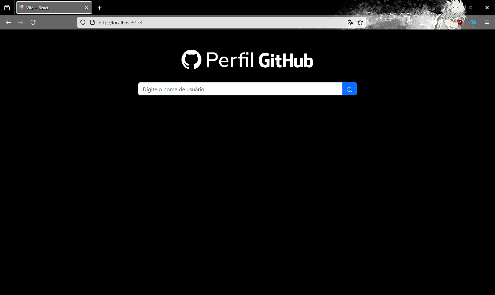
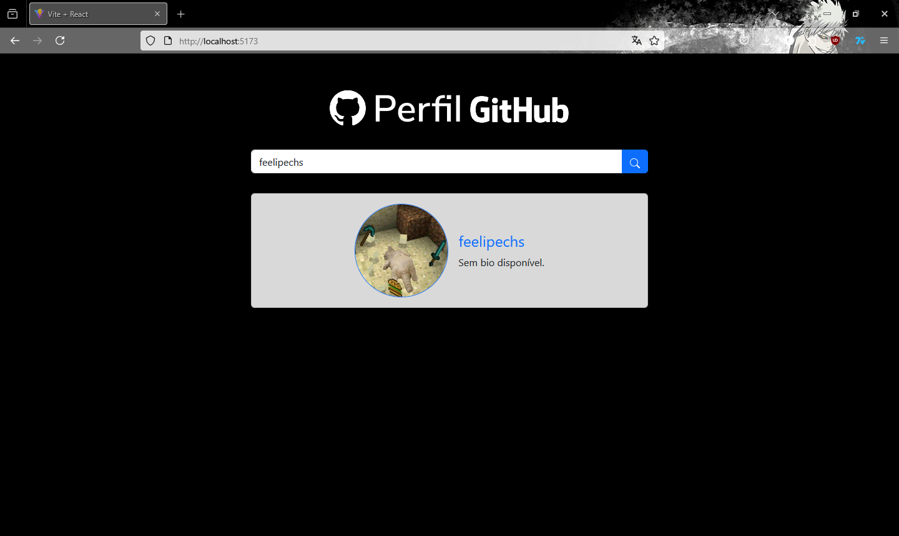
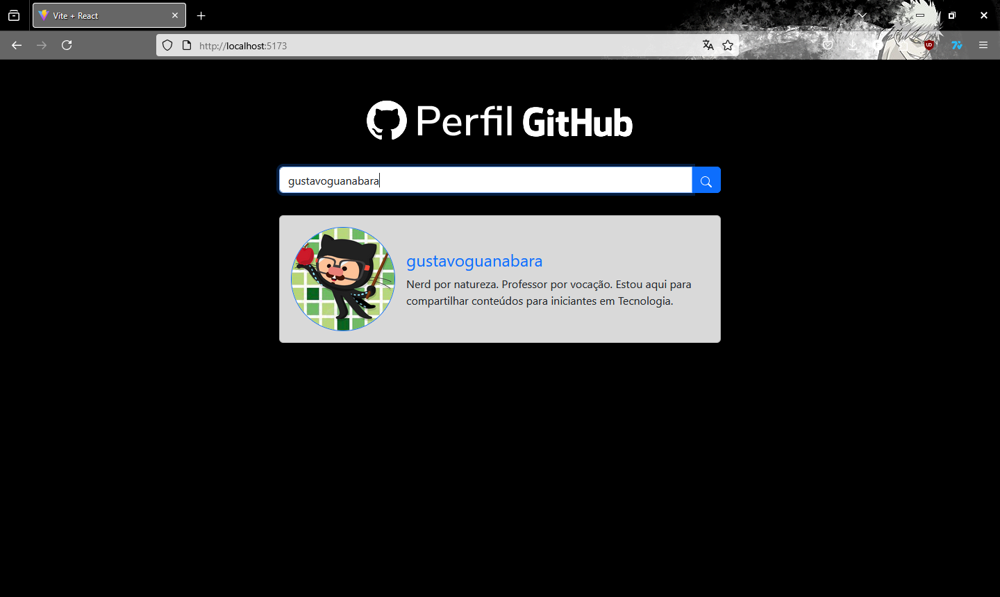
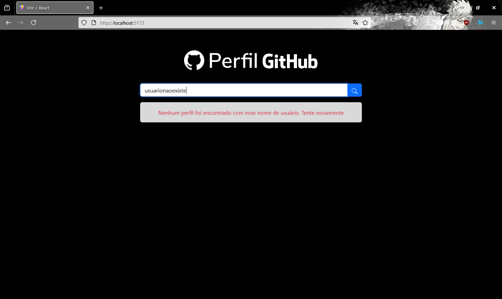
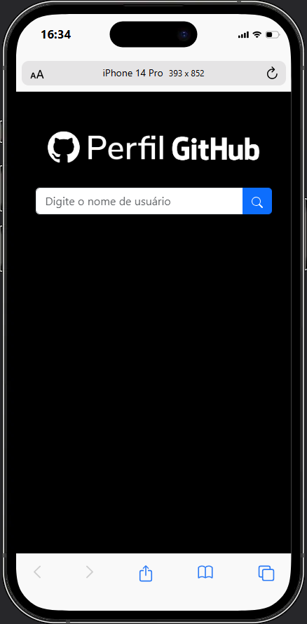
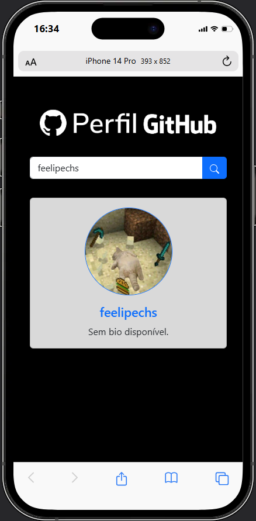

# Projeto 02- Busca de Perfil no GitHub

Tecnologias utilizadas:

React e Bootstrap

# Tela inicial:

HTML estruturado conforme o projeto do Figma

# Perfil encontrado (sem bio)

É informado quando não há biografia disponível

# Perfil encontrado (com bio)

É exibida a biografia quando disponível

# Perfil não encontrado

É informado quando o perfil não existe

# Responsividade

O projeto está responsivo, as imagens estão sendo simuladas em um iPhone 14 Pro

